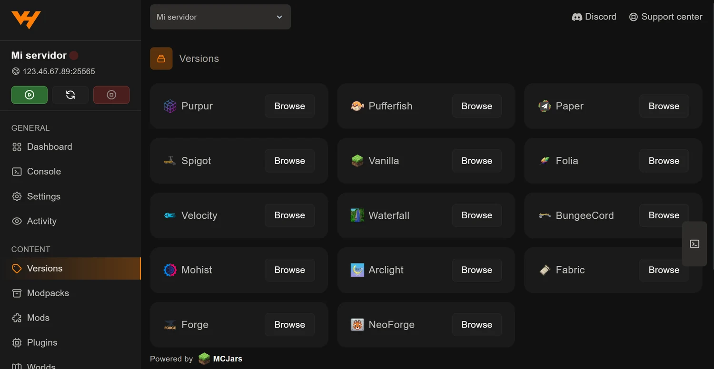
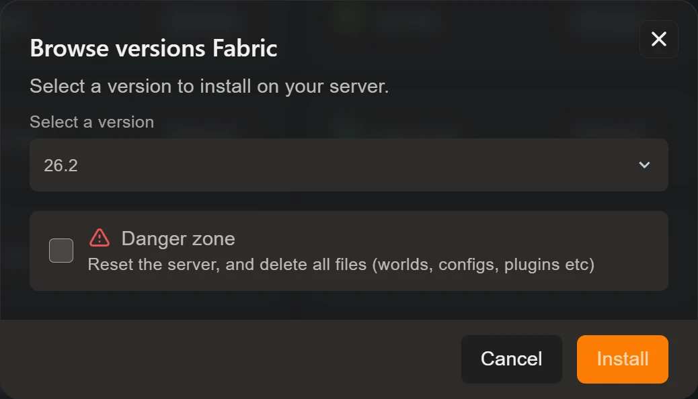

Cambiar la versión de Minecraft de tu servidor, o pasar de Vanilla a Paper para
poder usar plugins, es una pestaña y dos clics. Está en **Versions**, dentro
del grupo *Content* del menú lateral.

## Los catorce softwares que puedes instalar

El listado sale de **MCJars**, que mantiene las descargas oficiales de cada
proyecto al día. Están agrupados por lo que hacen:

| Familia | Softwares | Para qué |
| --- | --- | --- |
| Vanilla | Vanilla | Minecraft tal cual, sin plugins ni mods |
| Plugins | Paper, Spigot, Purpur, Pufferfish, Folia | Servidores con plugins; Paper es la opción por defecto |
| Mods | Fabric, Forge, NeoForge | Servidores con mods |
| Híbridos | Mohist, Arclight | Mods y plugins a la vez, a cambio de estabilidad |
| Proxies | Velocity, Waterfall, BungeeCord | Unir varios servidores bajo una sola IP |

Si no tienes claro cuál te conviene, la comparativa completa está en
[Paper, Spigot, Forge o Fabric: qué software elegir](/blog/paper-spigot-forge-fabric-cual-elegir/).

## Instalarlo

Pulsa **Browse** en el software que quieras y se abre la ventana de
instalación:

Tiene solo dos cosas:

- **Select a version**: el desplegable con todas las versiones publicadas.
  Incluye las snapshots y las release candidate, así que fíjate en lo que
  eliges si buscas algo estable.
- **Danger zone**: una casilla que dice *"Reset the server, and delete all
  files (worlds, configs, plugins etc)"*.

Sobre esa casilla, lo importante: **viene desmarcada y así debe quedarse** en
un cambio normal. Si no la tocas, el panel sustituye el software y deja
intactos tu mundo, tus configuraciones y tus mods. Solo tiene sentido marcarla
cuando quieras empezar de cero a propósito.

Elige la versión, comprueba que la casilla sigue desmarcada y pulsa
**Install**.

## Lo que sí conviene hacer antes

Que el instalador no borre nada no significa que no haya riesgo. El riesgo está
en el propio Minecraft: **cuando un mundo se abre con una versión más nueva, su
formato se actualiza y esa conversión no tiene vuelta atrás**. Podrás devolver
el software a la versión anterior, pero el mundo ya no abrirá bien en ella.

Así que, antes de subir de versión en un servidor con gente dentro:

1. Crea una copia desde la pestaña **Backups**. Ponle un nombre que lo diga,
   del tipo *"Antes de pasar a 1.21.4"*, y márcala como **Locked** para que no
   se la lleve la rotación automática. Lo tienes en
   [copias de seguridad en el panel](/blog/copias-seguridad-backups-panel/).
2. Comprueba que tus plugins o mods **ya existen para la versión nueva**. Es lo
   que más veces obliga a dar marcha atrás: el servidor arranca, pero medio
   modpack se queda fuera.
3. Avisa a tus jugadores, porque tendrán que cambiar de versión en el launcher.

## Qué pasa con lo que ya tenías

Depende de hacia dónde te muevas:

| Cambio | Qué ocurre |
| --- | --- |
| Paper → Purpur, Spigot → Paper | Los plugins siguen funcionando; son compatibles entre sí |
| Paper → Fabric o Forge | La carpeta `plugins` deja de usarse; necesitas mods |
| Fabric → Forge | Los mods **no** son compatibles; hay que rehacer la lista |
| Vanilla → cualquiera | El mundo se conserva y ganas plugins o mods |
| Subir de versión de Minecraft | El mundo se convierte al formato nuevo, sin marcha atrás |

## Después de instalar

Arranca el servidor y mira la **Console**. Los primeros segundos te dirán si
algún plugin o mod se ha quedado fuera por incompatibilidad.

Si has pasado a un cargador de mods, ya tienes disponible la pestaña **Mods**
para instalarlos sin descargar nada:
[cómo instalar mods desde el panel](/blog/instalar-mods-panel-automatico/).
Y si te has movido a Paper o Spigot, la equivalente es la pestaña **Plugins**:
[cómo instalar plugins desde el panel](/blog/instalar-plugins-panel/).

## No lo confundas con Reinstall Server

En la pestaña **Settings** hay un botón llamado **Reinstall Server**. No es lo
mismo y es bastante más agresivo: vuelve a ejecutar el script de instalación
original del servidor, y por el camino puede borrar o modificar archivos.

Para cambiar de versión o de software, lo que quieres es **Versions**.
