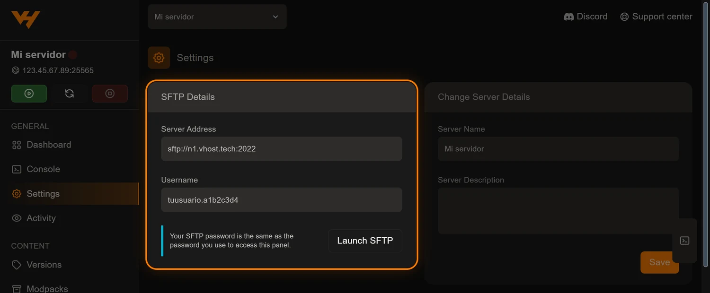
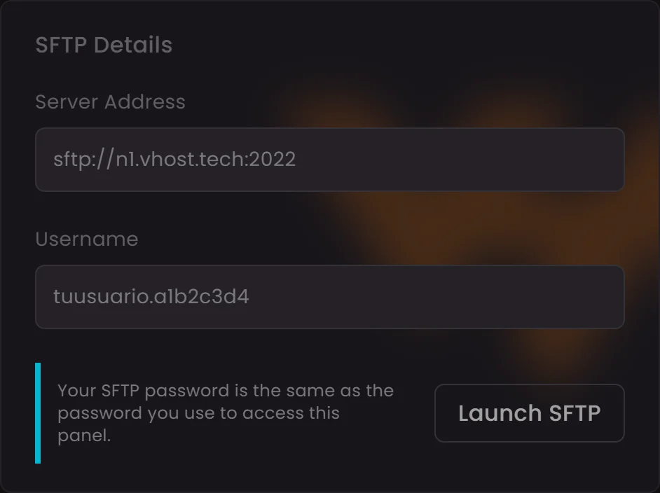
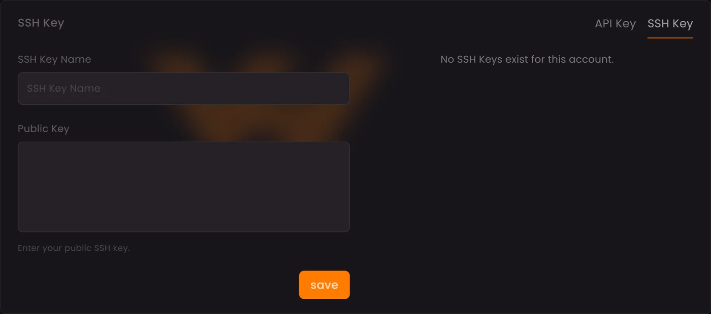

Los datos para conectarte por SFTP están en el panel, en el bloque
**SFTP Details** de tu servidor. Son tres: la dirección con su puerto (**2022**,
no el del juego), un usuario con la forma `usuario.IDdelservidor` y, como
contraseña, **la misma que usas para entrar al panel**. Con eso, FileZilla o
WinSCP se conectan en menos de un minuto.

## Dónde están tus datos de acceso

Entra en el panel, abre tu servidor y pulsa **Settings** en el menú de la
izquierda. El primer bloque de esa página es **SFTP Details**:

De ese bloque salen los dos datos que hay que copiar al cliente:

| Campo | Ejemplo | Qué es |
| --- | --- | --- |
| Server Address | `sftp://n1.vhost.tech:2022` | El nodo donde vive tu servidor y el puerto del SFTP |
| Username | `tuusuario.a1b2c3d4` | Tu usuario del panel, un punto y el ID del servidor |
| Contraseña | — | La misma del panel, no se muestra |

Ese mismo bloque aparece también en el **Dashboard** del servidor, y el botón
**Launch SFTP** abre directamente el cliente que tengas asociado en tu sistema.

El nodo y el puerto que ves arriba son un ejemplo: **copia siempre los que
aparezcan en tu panel**, porque cambian según el nodo en el que esté tu
servidor.

## FileZilla, paso a paso

Descárgalo de la web oficial, [filezilla-project.org](https://filezilla-project.org/).
Ahí verás dos productos y solo uno te vale:

> **Descarga «FileZilla Client», no «FileZilla Server».** El *Client* es el
> programa con el que te conectas a tu servidor, que es lo que necesitas. El
> *Server* sirve para montar tu propio servicio de archivos y no tiene nada que
> ver con esto.

Es gratuito y funciona en Windows, macOS y Linux.

1. Abre **Archivo → Gestor de sitios** y pulsa **Nuevo sitio**.
2. En **Protocolo**, elige `SFTP - SSH File Transfer Protocol`.
3. En **Servidor**, escribe el host sin el `sftp://` (por ejemplo
   `n1.vhost.tech`). En **Puerto**, `2022`.
4. **Modo de acceso**: `Normal`.
5. Rellena **Usuario** y **Contraseña** con los datos del panel.
6. Pulsa **Conectar**. La primera vez FileZilla te enseñará la huella de la
   clave del servidor: acéptala y marca la casilla para no volver a verla.

## WinSCP, paso a paso

Descárgalo de [winscp.net/eng/download.php](https://winscp.net/eng/download.php).
También es gratuito, pero **solo existe para Windows**: si vas con macOS o
Linux, quédate con FileZilla.

1. En la ventana de **Nueva sesión**, elige **Protocolo de archivo: SFTP**.
2. **Nombre del servidor**: el host del panel. **Número de puerto**: `2022`.
3. Rellena **Usuario** y **Contraseña**.
4. Pulsa **Guardar** para dejarlo memorizado y luego **Conectar**. Acepta la
   huella de la clave la primera vez.

## Qué te vas a encontrar dentro

Al conectar caes en `/home/container`, que es la raíz de tu servidor. Todo lo
que hay ahí es lo mismo que ves en el gestor de archivos del panel:

| Carpeta o archivo | Para qué sirve |
| --- | --- |
| `server.jar` | El ejecutable del servidor |
| `server.properties` | La configuración principal de Minecraft |
| `logs/` | Los registros, el primer sitio donde mirar cuando algo falla |
| `plugins/` | Los plugins, si usas Paper, Spigot o Purpur |
| `mods/` | Los mods, si usas Forge, NeoForge o Fabric |
| `world/`, `world_nether/`, `world_the_end/` | Tus mundos |

Las carpetas de plugins o mods aparecen según el software que tengas instalado;
en un servidor vanilla no existen.

## Cuándo merece la pena el SFTP

El gestor de archivos del panel vale para casi todo, pero hay cosas para las
que el SFTP es claramente mejor:

- **Instalar un modpack** con cientos de archivos.
- **Subir o descargar un mundo entero**, con sus carpetas.
- **Cargas grandes**, donde una subida por el navegador se hace eterna.
- **Trabajar con carpetas completas**, arrastrando desde tu escritorio.

Para añadir un plugin suelto, cambiar dos líneas de un `.yml` o mirar un log,
abre el panel: llegas antes.

## Los cuatro fallos de siempre

| Síntoma | Causa | Solución |
| --- | --- | --- |
| `Connection refused` | Estás usando el puerto del juego | Usa el del bloque SFTP Details (2022) |
| Usuario o contraseña incorrectos | Falta el `.IDdelservidor` en el usuario | Copia el usuario tal cual del panel |
| El cliente no llega a conectar | Está configurado como FTP o FTPS | Cambia el protocolo a SFTP |
| Funcionaba y ha dejado de hacerlo | Cambiaste la contraseña del panel | Actualiza la contraseña guardada en el cliente |

## Entrar sin escribir la contraseña

Si te conectas a diario, añade una **clave SSH**. En el panel, entra en
**Account**, abre la pestaña **SSH Keys** y pulsa **Create SSH Key**:

Ponle un nombre que reconozcas —normalmente el del ordenador desde el que te
conectas— y pega tu **clave pública** en el campo grande. Si la tienes en un
archivo, el botón **Upload key file** te la carga sin abrirlo.

Guarda y listo: a partir de ahí el cliente autentica con la clave y te olvidas
de escribir la contraseña.

Ojo con lo que pegas: aquí va la clave **pública**, la que termina en `.pub`.
La privada no sale nunca de tu ordenador.

## Antes de tocar archivos grandes

Para el servidor desde el panel antes de sustituir un mundo o el `server.jar`.
Con el servidor encendido esos archivos están en uso, y reemplazarlos a medio
camino es la forma más rápida de corromper un mundo. Y si vas a hacer un cambio
serio, haz antes una copia de seguridad: se crea en dos clics desde la pestaña
**Backups**.
