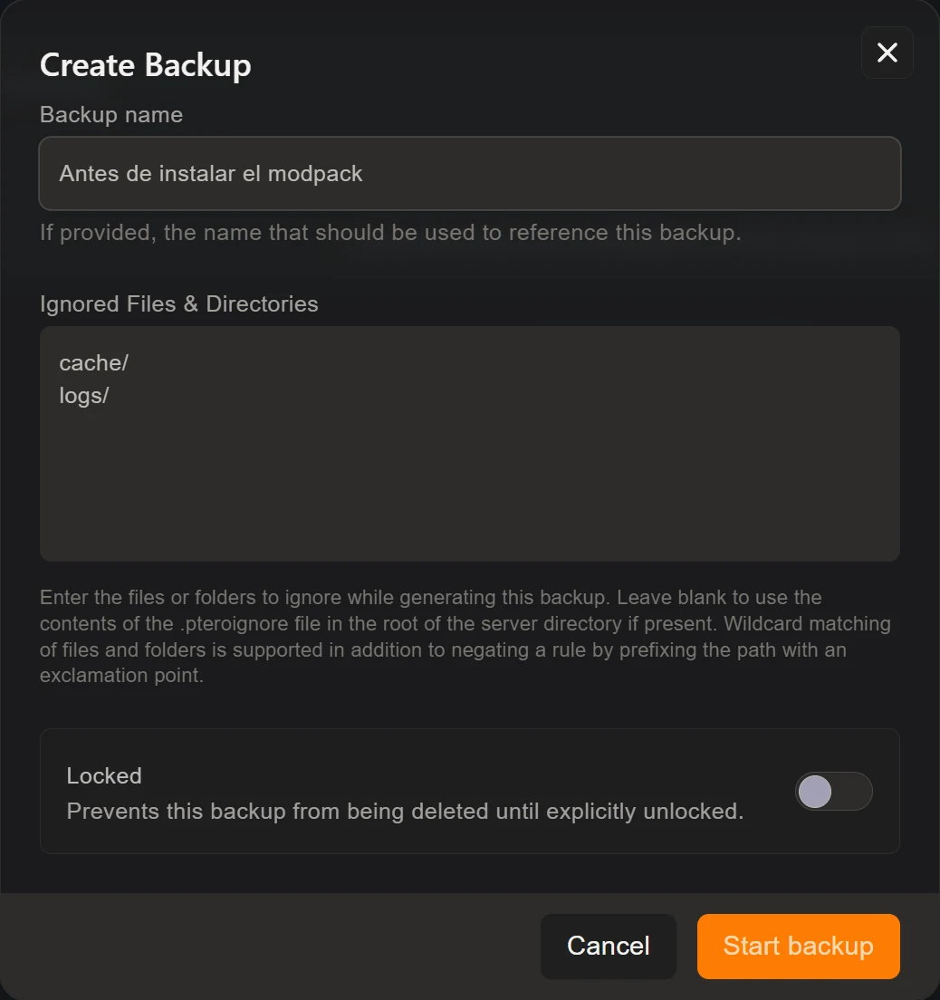

Las copias de seguridad viven en la pestaña **Backups** de tu servidor. Con
**Create backup** guardas el estado completo de la carpeta del servidor en ese
momento; después podrás descargarla, bloquearla para que nadie la borre o
restaurarla si algo se tuerce. Es la única red de seguridad real que tienes:
ni el gestor de archivos ni el SFTP tienen papelera.

## Crear una copia

Pulsa **Create backup** y verás tres campos:

- **Backup name**: el nombre con el que la reconocerás. Si lo dejas vacío se
  genera uno automático, pero un nombre como `antes-de-subir-a-1.21` te va a
  ahorrar tiempo dentro de dos meses.
- **Ignored Files & Directories**: carpetas y archivos que quieres dejar fuera.
- **Locked**: impide que la copia se borre mientras siga marcada.

Al confirmar con **Start backup**, la copia se genera en segundo plano. Puedes
seguir usando el servidor mientras tanto.

## Qué conviene excluir

Cuanto más pesada es la copia, más tarda y más ocupa. Estas exclusiones casi
siempre compensan:

| Ruta | Por qué dejarla fuera |
| --- | --- |
| `logs/` | Registros antiguos que no vas a restaurar nunca |
| `cache/`, `.cache/` | Se regenera sola al arrancar |
| `crash-reports/` | Solo sirven en el momento del fallo |
| `dynmap/` | Los mapas renderizados pesan muchísimo y se vuelven a generar |

El campo admite comodines, y puedes **negar una regla** poniendo un signo de
exclamación delante de la ruta, para excluir una carpeta entera pero rescatar
algo de dentro. Si dejas el campo vacío, el panel usa el archivo `.pteroignore`
de la raíz del servidor, si es que existe.

## Bloquear la copia buena

La casilla **Locked** es más útil de lo que parece. Una copia bloqueada no se
puede borrar hasta que la desbloquees, así que sobrevive tanto a un clic
descuidado como a la rotación cuando llegas al límite de copias de tu plan.

La costumbre sana: antes de un cambio grande, crea una copia, **bloquéala**, y
desbloquéala cuando estés seguro de que el cambio ha ido bien.

## Restaurar

Cada copia terminada tiene su propio menú, con la opción de restaurar,
descargar o borrar. Ten claro lo que hace la restauración: **sobrescribe el
estado actual** con el de la copia, y todo lo que haya pasado desde entonces se
pierde.

Por eso, antes de restaurar una copia de hace una semana, crea una del estado
de hoy. Si resulta que en el mundo actual había algo que querías conservar,
seguirás teniéndolo.

## Cuándo crear una copia

No hace falta obsesionarse, pero hay cinco momentos en los que es obligatorio:

1. **Antes de cambiar de versión** de Minecraft.
2. **Antes de instalar un modpack** o una tanda grande de plugins.
3. **Antes de tocar configuraciones a fondo**, sobre todo las de generación de
   mundo.
4. **Antes de reinstalar el servidor** desde Settings, que borra archivos.
5. **Después de una construcción importante** que te dolería perder.

## Que se hagan solas

Lo mejor de todo es no tener que acordarte. En la pestaña **Schedules** puedes
crear una tarea con la acción **Create backup** y la periodicidad que quieras
—cada día de madrugada, por ejemplo— y el panel se encarga. Lo vemos en la guía
de [tareas programadas](/blog/tareas-programadas-reinicios-automaticos/).

Una recomendación: si automatizas las copias, revisa de vez en cuando que
siguen creándose y que no te has quedado sin espacio. Una copia que falla en
silencio no es una copia.
