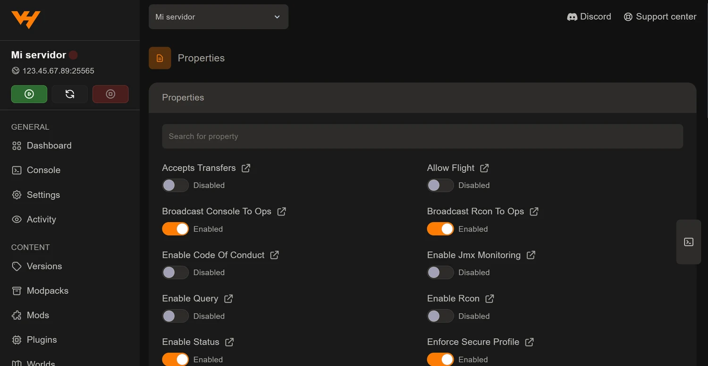

`server.properties` es el archivo donde vive la configuración básica de un
servidor de Minecraft: la dificultad, el número máximo de jugadores, el mensaje
que se ve en la lista, la distancia de renderizado. Son más de sesenta líneas
de texto plano donde un espacio de más rompe una propiedad sin avisar.

El panel te lo da como formulario, en la pestaña **Properties**, dentro del
grupo *Configuration*.

## Cómo se ve

Cada propiedad aparece con su nombre en lenguaje normal y el control que le
corresponde:

- **Interruptores** para las de sí o no (`Allow Flight`, `White List`,
  `Hardcore`…).
- **Desplegables** para las de opciones cerradas (`Difficulty`, `Gamemode`).
- **Campos de texto** para el resto (`Motd`, `Max Players`, `Level Name`).

Arriba hay un **buscador**. Con sesenta y pico propiedades es lo que de verdad
se usa: escribes `view` y te quedan las dos que buscabas.

El icono junto a cada nombre abre la documentación de esa propiedad en la wiki
de Minecraft, que viene bien para las que no son obvias.

## Los ajustes que más se tocan

| Propiedad | Qué hace |
| --- | --- |
| `Motd` | El texto bajo el nombre del servidor en la lista del juego |
| `Max Players` | Cuánta gente puede entrar a la vez |
| `Difficulty` | Peaceful, Easy, Normal o Hard |
| `Gamemode` | Survival, Creative, Adventure o Spectator |
| `View Distance` | Chunks que el servidor envía a cada jugador |
| `Simulation Distance` | Chunks donde de verdad ocurren cosas |
| `White List` | Solo entra quien esté en la lista |
| `Level Name` | Qué carpeta de mundo carga el servidor |
| `Level Seed` | La semilla, para generar un mundo concreto |
| `Pvp` | Si los jugadores pueden hacerse daño |

## Las dos que afectan al rendimiento

Si has llegado aquí buscando que el servidor vaya mejor, son estas dos:

**`View Distance`** es el ajuste con mejor relación esfuerzo-resultado de todo
Minecraft. Viene en 10 y bajarla a **6 u 8** reduce mucho el trabajo del
servidor, porque son chunks que deja de cargar y enviar por cada jugador
conectado. Casi no se nota jugando.

**`Simulation Distance`** marca hasta dónde ocurren las cosas de verdad: mobs
moviéndose, cultivos creciendo, redstone funcionando. Puede ser menor que la
anterior. Bajarla ayuda, pero con cuidado: si la pones muy corta, las granjas
automáticas dejan de funcionar cuando el jugador se aleja.

El diagnóstico completo, con cómo medir antes de tocar nada, está en
[cómo subir los TPS y quitar el lag](/blog/subir-tps-quitar-lag-servidor-minecraft/).

## Una que conviene no tocar

**`Online Mode`** comprueba contra los servidores de Mojang que cada jugador
tiene una cuenta legítima. **Déjala activada.** Desactivarla permite que
cualquiera entre con el nombre que quiera, incluido el de tus administradores,
y es un agujero de seguridad de los serios.

## Guarda y reinicia

`server.properties` se lee cuando el servidor arranca. Salvo alguna excepción
suelta, **los cambios no se aplican hasta que reinicies**.

Lo práctico es dejar todo cambiado y reiniciar una sola vez al final, en vez de
ir reiniciando por cada ajuste.

## Si prefieres el archivo de texto

La pestaña Properties es cómoda, pero no es la única vía: en **Files** puedes
abrir `server.properties` y editarlo tal cual, que a veces es más rápido si
sabes exactamente qué línea quieres cambiar o vas a pegar varias de golpe.
Lo tienes en
[la guía del gestor de archivos](/blog/gestor-archivos-panel-plugins-mods/).

Las dos formas escriben el mismo archivo, así que puedes alternar sin problema.
