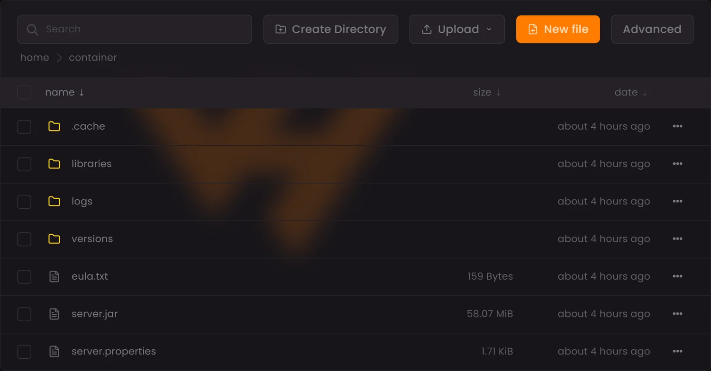
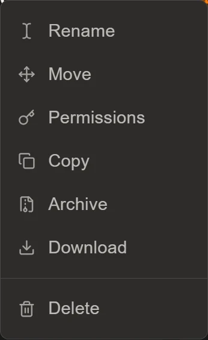

El gestor de archivos del panel está en la pestaña **Files** de tu servidor y
te enseña `/home/container`, la raíz donde vive todo. Desde ahí puedes subir
plugins y mods, editar cualquier configuración en el navegador, comprimir,
mover y cambiar permisos, sin instalar nada.

## Lo que ves al entrar

La barra superior tiene cuatro herramientas:

- **Search**: busca por nombre dentro de la carpeta en la que estés.
- **Create Directory**: crea una carpeta.
- **Upload**: la flecha de al lado despliega tres formas de subir —**Upload
  Files** para archivos sueltos, **Upload Folders** para una carpeta entera y
  **Upload from URL**, donde pegas el enlace directo a un archivo y lo descarga
  el propio servidor, sin pasar por tu conexión.
- **New file**: crea un archivo vacío y lo abre en el editor.

Justo debajo hay una miga de pan (`home / container`) que te dice dónde estás y
te deja volver atrás de un clic.

## Subir plugins y mods

El sitio depende del software que use tu servidor:

| Software | Carpeta | Qué admite |
| --- | --- | --- |
| Paper, Spigot, Purpur | `plugins/` | Plugins `.jar` |
| Forge, NeoForge, Fabric | `mods/` | Mods `.jar` |
| Vanilla | — | Ni una cosa ni la otra |

Si la carpeta no existe, créala con **Create Directory** con ese nombre exacto,
en minúsculas. Copia dentro el `.jar` y **reinicia el servidor**: los plugins y
los mods se cargan al arrancar, así que hasta ese momento no pasará nada.

Para subir, puedes arrastrar los archivos directamente sobre la lista. Con un
modpack completo es mejor subir el `.zip` y descomprimirlo ya dentro del
servidor, o tirar de [SFTP con FileZilla o WinSCP](/blog/conectar-sftp-filezilla-winscp/).

## Editar configuraciones sin descargar nada

Pulsa el nombre de cualquier archivo de texto —`server.properties`, un `.yml`
de un plugin, `eula.txt`— y se abre el editor del panel. Cambias lo que
necesites, guardas y reinicias.

Es la forma cómoda de tocar ajustes sueltos: bajar el `view-distance`, cambiar
el `motd` o poner el servidor en modo creativo para una prueba.

## El menú de cada archivo

El botón de los tres puntos al final de cada fila abre siete acciones:

| Acción | Para qué |
| --- | --- |
| **Rename** | Cambiar el nombre |
| **Move** | Mover a otra carpeta |
| **Permissions** | Ajustar permisos, el equivalente a un `chmod` |
| **Copy** | Duplicar el archivo |
| **Archive** | Comprimirlo |
| **Download** | Descargarlo a tu equipo |
| **Delete** | Borrarlo, sin papelera ni vuelta atrás |

Las casillas de la izquierda permiten seleccionar varios archivos a la vez y
aplicarles la misma acción en bloque, que es lo práctico cuando hay que limpiar
una carpeta de plugins.

## Cuándo no hace falta el gestor

Buena parte de lo que antes se hacía aquí a mano tiene ahora pestaña propia, y
sale más rápido:

| Si quieres… | Usa | En vez de |
| --- | --- | --- |
| Instalar un mod | Pestaña **Mods** | Subir el `.jar` a `mods/` |
| Instalar un plugin | Pestaña **Plugins** | Subir el `.jar` a `plugins/` |
| Instalar un modpack | Pestaña **Modpacks** | Subir el server pack |
| Poner un mapa | Pestaña **Worlds** | Subir la carpeta del mundo |
| Cambiar `server.properties` | Pestaña **Properties** | Editar el archivo |
| Cambiar de software o versión | Pestaña **Versions** | Sustituir `server.jar` |

Las tienes explicadas en
[instalar mods desde el panel](/blog/instalar-mods-panel-automatico/),
[instalar plugins](/blog/instalar-plugins-panel/),
[instalar un modpack](/blog/instalar-modpack-panel/),
[poner un mapa](/blog/instalar-mapa-mundo-panel/),
[configurar server.properties](/blog/editar-server-properties-panel/) y
[cambiar la versión o el software](/blog/cambiar-version-software-servidor/).

El gestor de archivos sigue siendo imprescindible para todo lo demás: editar
el `config.yml` de un plugin, mover carpetas, revisar `logs/` cuando algo falla
o subir un `.jar` que no está en ningún repositorio, como cuenta
[instalar mods manualmente](/blog/instalar-mods-manualmente-jar/).

## Cuándo dejar el navegador

El gestor cubre el día a día, pero hay tres casos en los que conviene pasarse
al SFTP:

- Modpacks o mundos con muchísimos archivos.
- Descargar una carpeta entera a tu equipo.
- Subidas grandes en las que el navegador se atraganta.

## Antes de borrar nada

El borrado del gestor es inmediato y **no hay papelera**. Si vas a reorganizar
carpetas o a limpiar plugins viejos, crea antes una copia desde la pestaña
**Backups**: son dos clics y te ahorra el disgusto.
