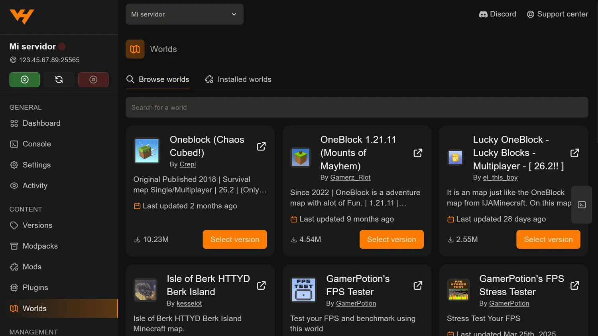

Un mapa de Minecraft es una carpeta de mundo. Ponerlo en tu servidor es
dejarla en el sitio correcto y decirle al servidor que cargue esa y no la suya.

El panel lo hace por ti desde la pestaña **Worlds**, en el grupo *Content*.

## Desde la pestaña Worlds



Funciona como las demás pestañas de contenido: buscas, eliges y **Select
version**. Encontrarás sobre todo mapas de OneBlock, skyblock, aventura y
parkour, que son los que más se juegan en servidores con amigos.

La pestaña **Installed worlds** te dice cuáles tienes ya descargados.

## Lo que de verdad decide qué mundo carga

Esta es la parte que despista a casi todo el mundo: **tener la carpeta del mapa
en el servidor no basta**. El servidor carga el mundo cuyo nombre aparece en la
propiedad `level-name` de `server.properties`.

Si el mapa se llama `OneBlock`, la propiedad tiene que decir exactamente eso:

```
level-name=OneBlock
```

Lo cambias sin tocar archivos desde la pestaña **Properties**, buscando
`level-name` en su buscador. Está explicado en
[cómo configurar server.properties desde el panel](/blog/editar-server-properties-panel/).

Después, **reinicia**. El cambio de mundo solo se aplica al arrancar.

Dos detalles que ahorran disgustos:

- El nombre distingue mayúsculas de minúsculas.
- Si te equivocas y pones un nombre que no existe, el servidor no falla:
  **genera un mundo nuevo y vacío con ese nombre**. Si arrancas y apareces en
  un mundo recién creado, revisa cómo lo has escrito.

## Subir un mapa que te has descargado tú

Si el mapa no está en la pestaña Worlds, se sube a mano:

1. Descomprime el `.zip` en tu ordenador. Dentro tiene que haber una carpeta
   con un archivo `level.dat`: **esa** es la carpeta del mundo, y a veces está
   metida un nivel más adentro de lo que parece.
2. En la pestaña **Files**, en la raíz del servidor, usa **Upload** →
   **Upload Folders** y sube esa carpeta.
3. Cambia `level-name` al nombre de la carpeta.
4. Reinicia.

Para un mapa grande, el navegador puede quedarse corto. En ese caso sube el
`.zip` y descomprímelo ya dentro del servidor, o conéctate por
[SFTP con FileZilla o WinSCP](/blog/conectar-sftp-filezilla-winscp/).

## La versión importa

Muchos mapas, sobre todo los de aventura, están hechos para una versión
concreta de Minecraft. Dependen de comandos, de bloques y de estructuras que
cambian entre versiones, y al abrirlos en otra se rompen de formas raras:
puertas que no se abren, comandos que no disparan, zonas vacías.

Mira para qué versión se publicó el mapa y, si hace falta, cámbiala desde
[la pestaña Versions](/blog/cambiar-version-software-servidor/). Ten en cuenta
que abrir un mundo en una versión más nueva actualiza su formato **sin marcha
atrás**.

## Antes de cambiar de mapa, una copia

Cambiar `level-name` no borra el mundo anterior: se queda en su carpeta y
puedes volver cuando quieras. Pero si vas a mover carpetas o a hacer limpieza,
crea antes una copia desde **Backups**, que el borrado del gestor de archivos
no tiene papelera:
[copias de seguridad en el panel](/blog/copias-seguridad-backups-panel/).

Y si andas justo de disco, acuérdate de que los mundos viejos siguen ocupando
sitio aunque no se usen.
