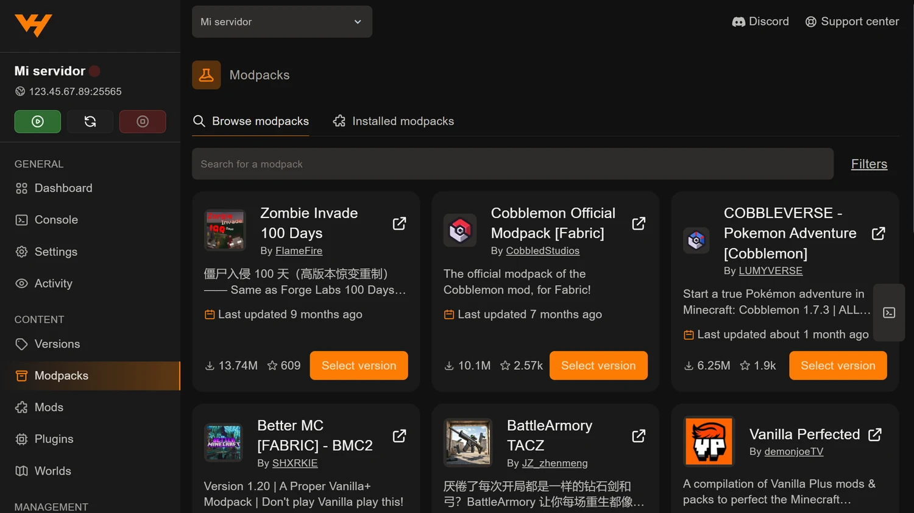

Un modpack son decenas o cientos de mods ya elegidos y configurados para
funcionar juntos. Montar uno a mano es un trabajo largo; el panel lo hace en un
clic desde la pestaña **Modpacks**, en el grupo *Content*.

## Cómo se instala

Funciona igual que la pestaña de mods: buscador arriba, **Filters** a la
derecha para acotar por plataforma y versión, y un botón **Select version** en
cada tarjeta.

Eliges el modpack, eliges la versión y el panel se encarga del resto: descarga
el pack, instala el cargador que necesite —Fabric, Forge o NeoForge— y coloca
todos los mods y sus configuraciones en su sitio.

La pestaña **Installed modpacks**, al lado, te dice qué tienes puesto.

## La mitad que no hace el panel

Esto es lo que más dudas genera, así que va en claro: **el panel prepara el
servidor, no a tus jugadores**.

Cada persona que quiera entrar necesita **el mismo modpack y la misma versión**
instalados en su ordenador. Se hace con un launcher que los gestione:

- **Modrinth App**, si el pack está en Modrinth
- **CurseForge App**, si está en CurseForge
- **Prism Launcher** o **ATLauncher**, que admiten los dos

Si a alguien le rechaza la conexión nada más entrar, lo primero que hay que
mirar es si tiene exactamente la misma versión del pack.

## Antes de instalar, dos cosas

**Crea una copia.** Instalar un modpack sustituye la carpeta de mods y buena
parte de las configuraciones. El mundo suele sobrevivir, pero un mundo generado
sin esos mods se comporta de forma extraña: falta el terreno nuevo, faltan
estructuras y a veces aparecen bloques inexistentes. Lo tienes en
[copias de seguridad en el panel](/blog/copias-seguridad-backups-panel/).

**Mira la RAM.** Es la causa número uno de que un servidor con modpack vaya
mal:

| Modpack | Jugadores | RAM recomendada |
| --- | --- | --- |
| Ligero | 2-5 | 8 GB |
| Mediano | 5-10 | 12 GB |
| Grande (RLCraft, All the Mods) | 5-10 | 16 GB o más |

Los números completos, con el detalle de por qué, están en
[cuánta RAM necesita un servidor de Minecraft](/blog/cuanta-ram-servidor-minecraft/).

## Después de instalar

Arranca el servidor y ten paciencia: **el primer arranque de un modpack grande
tarda varios minutos**. El cargador tiene que procesar todos los mods y generar
sus archivos de configuración. Que parezca colgado durante un rato es normal.

Vigila la **Console**. Si algo no encaja, el error sale ahí.

Cuando entre el primer jugador, comprueba los TPS con `/tps`. Si van por debajo
de 20 desde el principio, casi siempre es memoria justa:
[cómo subir los TPS y quitar el lag](/blog/subir-tps-quitar-lag-servidor-minecraft/).

## Si quieres añadir algún mod al pack

Se puede, con cuidado: cualquier mod que añadas tiene que ser del mismo
cargador y de la misma versión de Minecraft que el pack, y tendrán que
instalarlo también todos tus jugadores.

Lo haces desde la pestaña **Mods**, como cuenta
[la guía de instalar mods desde el panel](/blog/instalar-mods-panel-automatico/).
Y antes de reiniciar, pasa la carpeta entera por el
[comprobador de mods](/utilidades/comprobador-mods/) para ver si has roto
alguna dependencia del pack.

## Si el modpack no está en ninguna de las dos webs

Entonces toca a mano: bajas el **server pack** del modpack —la versión para
servidor, no la de cliente—, lo subes por SFTP y ajustas el arranque. Es
bastante más trabajo, y lo tienes explicado en
[instalar mods manualmente](/blog/instalar-mods-manualmente-jar/) y en
[conectarte por SFTP](/blog/conectar-sftp-filezilla-winscp/).
