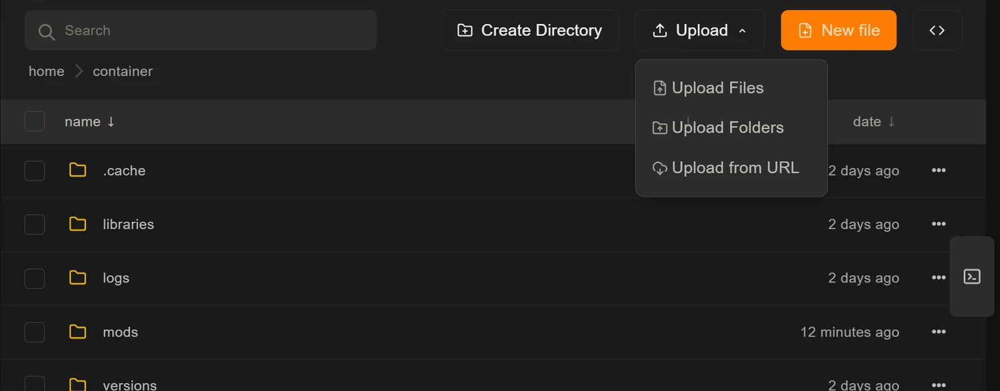
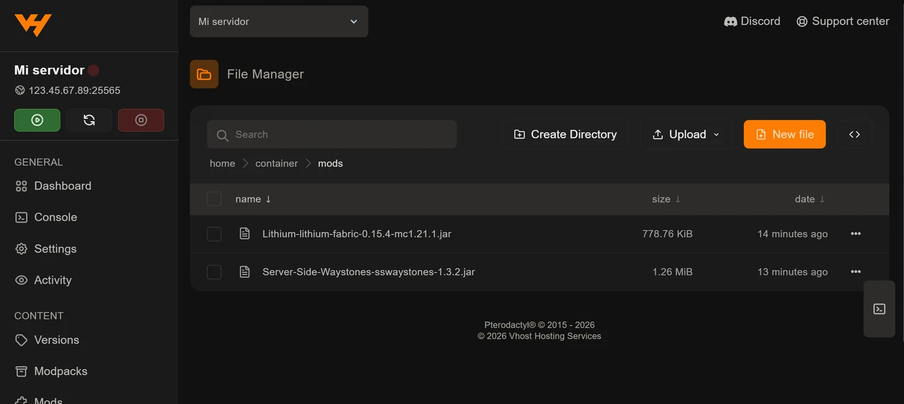

Instalar un mod a mano es copiar un archivo `.jar` en la carpeta correcta y
reiniciar. No tiene más misterio, pero conviene saber dónde va cada cosa y qué
forma de subirlo aguanta mejor según cuántos archivos sean.

Si el mod está en Modrinth o CurseForge, casi siempre te sale más a cuenta
usar la pestaña Mods del panel, que lo descarga en el servidor por ti:
[instalar mods desde el panel](/blog/instalar-mods-panel-automatico/).

## Cuándo tiene sentido hacerlo a mano

- El mod **no está publicado** en Modrinth ni en CurseForge.
- Necesitas **una compilación concreta** que el buscador del panel no lista.
- Te han pasado el `.jar` directamente, o lo has compilado tú.
- Vas a **mover un modpack entero** que ya tienes funcionando en tu ordenador.
- Quieres **sustituir un mod** por otra versión sin desinstalar y reinstalar.

## Antes: tu servidor necesita un cargador

Un `.jar` de mod suelto en un servidor Vanilla, Paper o Spigot no hace nada.
Hace falta **Fabric**, **Forge** o **NeoForge**, que se instalan en un clic
desde la pestaña **Versions**, como cuenta
[la guía de versiones y software](/blog/cambiar-version-software-servidor/).

La diferencia entre unos y otros está en
[Paper, Spigot, Forge o Fabric: qué software elegir](/blog/paper-spigot-forge-fabric-cual-elegir/).

## Dónde va cada cosa

Esta es la confusión más habitual, así que va en una tabla:

| Software del servidor | Carpeta | Qué admite |
| --- | --- | --- |
| Fabric, Forge, NeoForge, Quilt | `mods/` | Mods `.jar` |
| Paper, Spigot, Purpur | `plugins/` | Plugins `.jar` |
| Vanilla | — | Ni mods ni plugins |

Un mod en `plugins/` no se carga, y un plugin en `mods/` tampoco. Si la carpeta
que necesitas no existe, créala con **Create Directory** con ese nombre exacto
y en minúsculas.

## Subir el .jar desde el navegador

Abre la pestaña **Files**, entra en la carpeta `mods` y usa el botón
**Upload**. La flecha de al lado despliega tres formas de subir:



- **Upload Files**: archivos sueltos. Lo normal para uno o unos pocos mods.
- **Upload Folders**: una carpeta entera con todo su contenido. Es lo cómodo
  cuando quieres llevarte la carpeta `mods` de tu ordenador tal cual.
- **Upload from URL**: pegas el enlace directo al `.jar` y lo descarga el
  propio servidor. Como no pasa por tu conexión, es la opción rápida si tienes
  poca subida.

También puedes **arrastrar** los archivos directamente sobre la lista, sin
tocar el botón.

Cuando termine, la carpeta debería tener un aspecto parecido a este:



Fíjate en la miga de pan de arriba (`home / container / mods`): es la forma
rápida de confirmar que no has dejado los archivos un nivel más arriba, que es
el otro fallo clásico.

## Cuándo dejar el navegador y usar SFTP

El gestor web cubre bien lo cotidiano, pero tiene un límite práctico. Con un
modpack de cientos de archivos:

- la subida es lenta,
- un corte de conexión te obliga a empezar de cero,
- y el navegador puede quedarse sin memoria por el camino.

En ese caso hay dos salidas mejores. Una es subir el **`.zip`** del modpack y
descomprimirlo ya dentro del servidor desde el menú de la fila. La otra es
conectarte por **SFTP**, que aguanta las subidas grandes y permite reanudar:
lo tienes paso a paso en
[conectarte por SFTP con FileZilla o WinSCP](/blog/conectar-sftp-filezilla-winscp/).

## Comprueba la lista antes de reiniciar

Dos mods sueltos se revisan a ojo. Veinte, no. Antes de reiniciar merece la
pena pasar los `.jar` por el
[comprobador de mods](/utilidades/comprobador-mods/): te dice qué dependencias
faltan, qué mods son de solo cliente y si has mezclado cargadores, todo en tu
navegador y sin que los archivos salgan de tu ordenador.

Es exactamente la clase de error que, si no lo ves antes, acabas persiguiendo
en la consola con el servidor sin arrancar.

## Reinicia

Los mods se cargan al arrancar, así que hasta que no reinicies no pasará nada.
Hazlo desde el botón de la barra lateral y abre la **Console**: si falta una
dependencia o un `.jar` es de otra versión, el error aparece en los primeros
segundos y suele nombrar al mod culpable.

## Un truco para desactivar sin borrar

Si sospechas de un mod y quieres probar sin él, no hace falta borrarlo.
Renómbralo desde el menú de los tres puntos añadiendo algo al final:

```
mimod.jar  →  mimod.jar.desactivado
```

Al no terminar en `.jar`, el cargador lo ignora. Si resulta que no era el
culpable, le devuelves el nombre y listo. Es mucho más cómodo que borrar y
volver a subir mientras vas descartando.

## Y como siempre, una copia antes

El borrado del gestor de archivos es inmediato y no hay papelera. Antes de
reorganizar la carpeta `mods` de un servidor con gente dentro, crea una copia
desde **Backups**: son dos clics y está explicado en
[copias de seguridad en el panel](/blog/copias-seguridad-backups-panel/).
