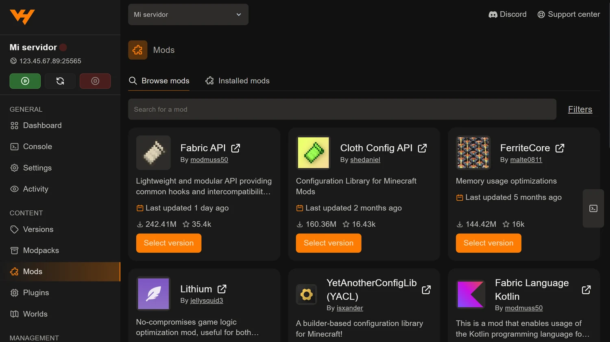
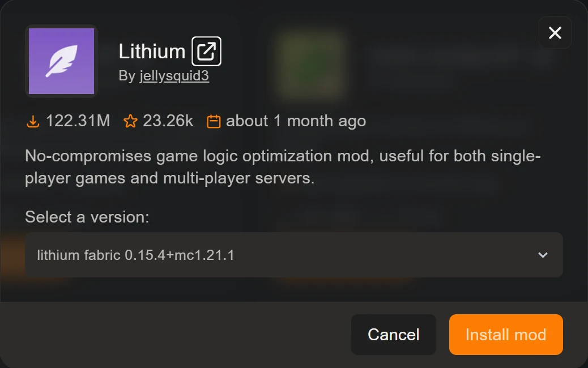
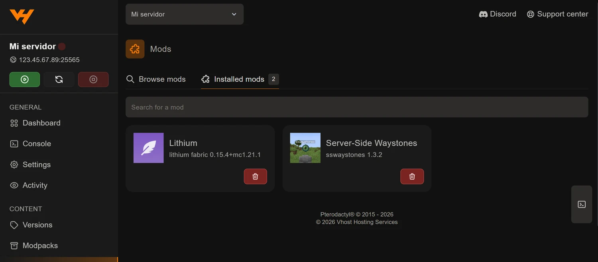

El panel tiene una pestaña **Mods** que busca en Modrinth y CurseForge y deja
el `.jar` directamente en la carpeta `mods` de tu servidor. No descargas nada a
tu ordenador ni abres el gestor de archivos: eliges el mod, eliges la versión y
listo.

Es la forma rápida de hacerlo. Si el mod que quieres no está en ninguna de las
dos webs, o necesitas una compilación concreta, mira la guía de
[instalar mods manualmente subiendo el .jar](/blog/instalar-mods-manualmente-jar/).

## Antes de nada: tu servidor tiene que admitir mods

La pestaña Mods trabaja sobre la carpeta `mods`, y esa carpeta solo existe si
tu servidor usa un cargador de mods. Si estás en Vanilla, Paper o Spigot, por
mucho que copies un `.jar` no va a pasar nada.

Instala primero **Fabric**, **Forge** o **NeoForge** desde la pestaña
**Versions**, que lo hace en un clic: lo tienes explicado en
[cómo cambiar la versión o el software de tu servidor](/blog/cambiar-version-software-servidor/).

Si todavía no sabes cuál te conviene, la comparativa está en
[Paper, Spigot, Forge o Fabric: qué software elegir](/blog/paper-spigot-forge-fabric-cual-elegir/).

## Buscar el mod

Abre **Mods** en el menú lateral, dentro del grupo *Content*. Verás dos
pestañas: **Browse mods**, que es el buscador, e **Installed mods**, con lo que
ya tienes puesto.

Arriba tienes el buscador y, a la derecha, **Filters**, que despliega tres
filtros:

| Filtro | Para qué |
| --- | --- |
| **Platform** | De dónde salen los resultados: Modrinth o CurseForge |
| **Version** | La versión de Minecraft de tu servidor |
| **Loader** | Tu cargador: `fabric`, `forge`, `neoforge`, `quilt`… |

Merece la pena rellenar **Version** y **Loader** antes de buscar. No es un
capricho: reduce la lista a mods que de verdad te sirven y te ahorra
descubrir el problema cuando el servidor ya no arranca.

Cada tarjeta trae el autor, la descripción, las descargas, cuándo se actualizó
por última vez y un botón **Select version**.

## El desplegable de versión, que es donde se falla

Al pulsar **Select version** se abre una ficha con el mod y un desplegable para
elegir qué versión instalar.

Aquí está el detalle importante, y conviene decirlo claro: **ese desplegable no
respeta los filtros que has puesto antes**. Lista todas las versiones que el
autor ha publicado —de todos los cargadores y de todas las versiones de
Minecraft— ordenadas de más nueva a más vieja, y deja marcada la primera.

Un ejemplo real: con los filtros puestos en Fabric y 1.21.1, el mod Lithium
ofrece 176 versiones y la que aparece marcada de entrada es
`lithium neoforge 0.25.3+mc26.2`. Ni el cargador ni la versión son los nuestros.
La correcta era `lithium fabric 0.15.4+mc1.21.1`, bastante más abajo en la
lista.

Los nombres suelen seguir el patrón `mod cargador versión+mcVERSIÓN`, así que
se leen bien. Comprueba las dos cosas:

- que el **cargador** sea el tuyo (`fabric`, `forge`, `neoforge`);
- que la **versión de Minecraft** detrás del `mc` sea la de tu servidor.

Cuando lo tengas, pulsa **Install mod**.

## Las dependencias las pones tú

El panel instala el archivo que has elegido, y solo ese. **No resuelve
dependencias.**

Lo hemos comprobado: al instalar *Server-Side Waystones*, que necesita Fabric
API, en la carpeta `mods` apareció únicamente el `.jar` de Waystones. Fabric API
no llegó sola. Un servidor así se cierra nada más arrancar con un error de
dependencia que no dice mucho.

Así que, si el mod pide algo, búscalo en la misma pestaña e instálalo igual.
Las dependencias más habituales en Fabric son **Fabric API**, **Architectury API**
y **Cloth Config API**.

Si vas a montar una lista larga y no quieres ir descubriendo los fallos de uno
en uno, súbelos antes a nuestro
[comprobador de mods](/utilidades/comprobador-mods/): te dice de un vistazo qué
dependencias faltan y qué mods son de solo cliente, sin salir del navegador y
sin que los archivos salgan de tu ordenador.

## Ver y quitar lo que tienes instalado

La pestaña **Installed mods** lista lo que hay en la carpeta `mods`, con el
nombre y la versión exacta de cada uno.

El botón rojo de cada tarjeta borra el `.jar` del servidor. Es la vía limpia
para quitar un mod que da problemas: lo borras, reinicias y vuelves a probar.

## Reinicia y comprueba

Los mods se cargan al arrancar. Reinicia el servidor desde la barra lateral y
abre la **Console**: si algo falta o no encaja, el error sale ahí en los
primeros segundos.

Y recuerda que tus jugadores necesitan **los mismos mods y la misma versión**
en su cliente, salvo que sean mods de solo servidor. Si a alguien le rechaza la
conexión, casi siempre es eso.

## Un consejo antes de tocar un servidor con gente

Crea una copia desde la pestaña **Backups** antes de instalar nada. Un mod
puede cambiar la generación del mundo o los datos guardados, y volver atrás sin
copia no siempre es posible. Está explicado en
[copias de seguridad en el panel](/blog/copias-seguridad-backups-panel/).
