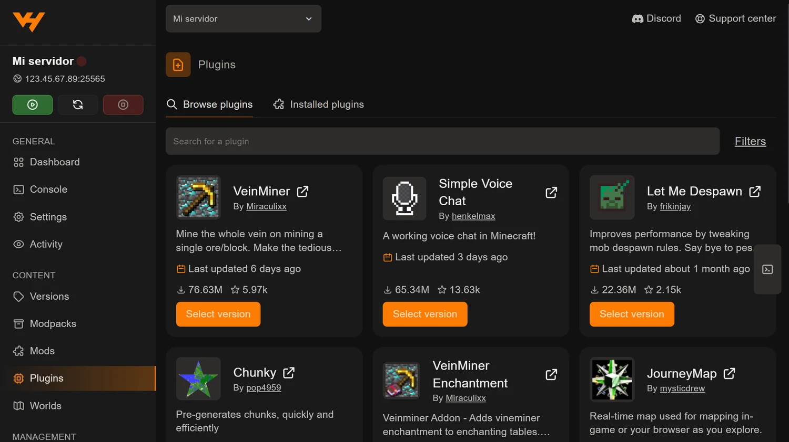

Los plugins añaden funciones al servidor sin que tus jugadores tengan que
instalar nada: entran con su Minecraft de siempre. Es la diferencia clave con
los mods, y la razón por la que la mayoría de servidores con amigos acaban
usándolos.

El panel los instala desde la pestaña **Plugins**, en el grupo *Content* del
menú lateral.

## Antes: tu servidor tiene que ser de plugins

La pestaña trabaja sobre la carpeta `plugins`, que solo existe en cierto
software:

| Software | ¿Admite plugins? |
| --- | --- |
| Paper, Spigot, Purpur, Pufferfish, Folia | Sí |
| Velocity, Waterfall, BungeeCord (proxies) | Sí, plugins de proxy |
| Mohist, Arclight (híbridos) | Sí, y mods también |
| Vanilla, Fabric, Forge, NeoForge | No |

Si estás en Vanilla, cambiar a **Paper** es un clic desde la pestaña
**Versions** y conserva tu mundo:
[cómo cambiar la versión o el software](/blog/cambiar-version-software-servidor/).

## Buscar e instalar

El buscador mira en **cuatro sitios a la vez**: Modrinth, CurseForge, Spigot y
**Hangar**, el repositorio oficial de PaperMC. Eso es bastante más cobertura de
la que tendrías buscando a mano en una sola web.

Desde **Filters** puedes acotar por:

| Filtro | Para qué |
| --- | --- |
| **Platform** | Limitar a una fuente concreta |
| **Version** | Tu versión de Minecraft |
| **Loader** | `paper`, `spigot`, `bukkit`, `purpur`, `folia`, `velocity`… |

Pulsa **Select version** en el plugin que quieras, elige la versión y confirma.

Un aviso que vale igual que para los mods: **el desplegable de versión no
hereda los filtros de la búsqueda**. Lista todas las versiones publicadas
ordenadas por fecha y deja marcada la más reciente, que puede no ser la de tu
servidor. Léela antes de instalar.

## Reinicia

Los plugins se cargan al arrancar. Reinicia desde la barra lateral y mira la
**Console**: ahí verás si el plugin ha cargado bien o si se queja de la versión.

Existen comandos de recarga, pero dan más problemas de los que ahorran y es
mejor no usarlos en un servidor con gente dentro.

## Dónde se configura

En el primer arranque, cada plugin crea su propia carpeta dentro de `plugins`,
normalmente con un `config.yml` dentro. Puedes editarlo desde el navegador sin
descargar nada, como cuenta
[la guía del gestor de archivos](/blog/gestor-archivos-panel-plugins-mods/).

Guarda, reinicia y los cambios se aplican.

## Cuatro plugins que casi todo el mundo acaba poniendo

Por si empiezas de cero:

- **EssentialsX** — comandos básicos: `/home`, `/tpa`, `/warp`, kits.
- **LuckPerms** — permisos y rangos, que es lo que necesitas en cuanto sois
  más de cuatro.
- **Chunky** — pregenera el mundo para que no dé tirones al explorar.
- **spark** — el medidor que te dice de verdad qué está causando el lag, y que
  usamos en
  [cómo subir los TPS y quitar el lag](/blog/subir-tps-quitar-lag-servidor-minecraft/).

## Si el plugin no está en el buscador

Se sube a mano: descargas el `.jar`, lo dejas en la carpeta `plugins` y
reinicias. El procedimiento es el mismo que con los mods, cambiando la carpeta
de destino, y lo tienes en
[instalar mods manualmente subiendo el .jar](/blog/instalar-mods-manualmente-jar/).

## Y si lo que quieres son mods y plugins a la vez

Existen los servidores híbridos —Mohist, Arclight, Ketting—, que montan la API
de plugins encima de un cargador de mods. Funcionan, pero son una capa de
compatibilidad: algunos plugins fallan, van por detrás en versiones y ni los
autores de plugins ni los de mods dan soporte a servidores híbridos.

Está desarrollado en
[Paper, Spigot, Forge o Fabric: qué software elegir](/blog/paper-spigot-forge-fabric-cual-elegir/).
