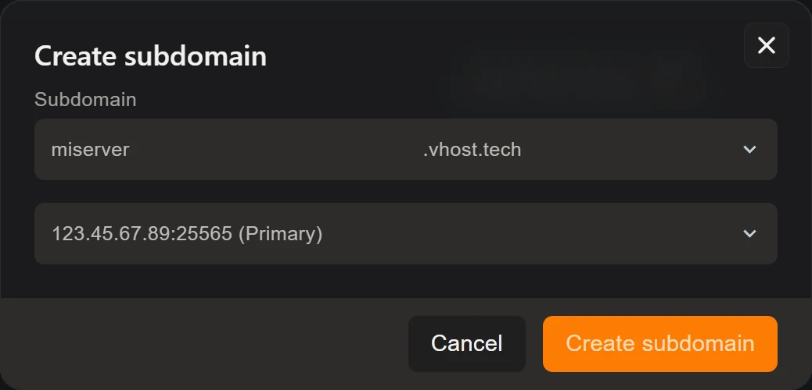
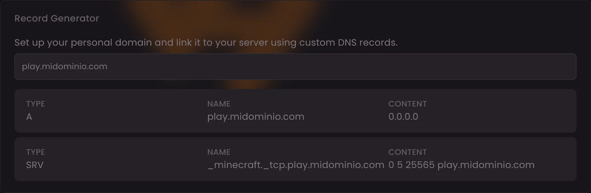

Una IP con puerto detrás no hay quien la recuerde. Tienes dos formas de
cambiarla por un nombre: **un subdominio `.vhost.tech` gratis**, que se crea en
el panel en quince segundos y no toca DNS, o **tu propio dominio**, para lo que
el panel te da los registros exactos ya calculados. La segunda opción necesita
dos registros: uno `A` y uno `SRV`.

## Opción rápida: un subdominio del panel

En tu servidor, abre la pestaña **Subdomains** y pulsa **Create subdomain**:

1. Escribe el nombre que quieras, por ejemplo `misurvival`.
2. Elige el dominio del desplegable: **`.vhost.tech`**.
3. Elige la asignación de tu servidor, que aparece marcada como *Primary*.
4. Confirma con **Create subdomain**.

Ya está: tus jugadores entran escribiendo `misurvival.vhost.tech`, sin puerto y
sin IP. No hay que esperar propagación ni configurar nada fuera del panel.

Es la opción que recomendamos si no tienes dominio propio o si quieres una
dirección decente para una comunidad pequeña.

## Opción con marca: tu propio dominio

Si ya tienes un dominio, la pestaña **Network** del panel trae un **Record
Generator**. Escribe en él el subdominio que quieras usar y te calcula los dos
registros:

| Tipo | Nombre | Contenido |
| --- | --- | --- |
| `A` | `play.tudominio.com` | La IP de tu servidor |
| `SRV` | `_minecraft._tcp.play.tudominio.com` | `0 5 PUERTO play.tudominio.com` |

> **Ojo con el registro A: el generador enseña `0.0.0.0` como contenido y ese
> valor no sirve.** Es la dirección interna con la que el servidor escucha, no
> su IP pública. En el registro A tienes que poner **la IP que aparece arriba,
> en la barra de estado del servidor**, la misma a la que se conectan tus
> jugadores. El registro SRV sí viene bien calculado, con el puerto correcto.

Con esa corrección hecha, copia los dos registros en el panel DNS de tu
proveedor —el registrador donde compraste el dominio, Cloudflare, o quien te
lleve la zona—.

### Qué hace cada uno

- El **registro A** traduce `play.tudominio.com` a la IP donde está tu
  servidor. Con esto solo, tus jugadores tendrían que escribir
  `play.tudominio.com:PUERTO`.
- El **registro SRV** es el que esconde el puerto. Sus cuatro valores son
  prioridad (`0`), peso (`5`), **puerto** y destino, que apunta al nombre del
  registro A. Con él, el cliente de Minecraft averigua solo a qué puerto tiene
  que ir.

Por eso el SRV **necesita que el A exista**: no apunta a una IP, apunta al
nombre.

### Detalles que fastidian la mitad de los intentos

- **El nombre del SRV lleva los guiones bajos**: `_minecraft._tcp.` delante del
  subdominio. Sin ellos no funciona.
- Algunos paneles DNS **piden prioridad, peso, puerto y destino en campos
  separados** en vez de en una sola línea. Reparte los cuatro valores en el
  orden en el que aparecen.
- Otros **añaden el dominio automáticamente** al nombre. Si al guardar te queda
  `play.tudominio.com.tudominio.com`, escribe solo `play` en ese campo.
- En **Cloudflare**, el registro A tiene que estar en **DNS only** (nube gris).
  Con el proxy activado la conexión no llega: ese proxy solo entiende tráfico
  web, y Minecraft no lo es.
- Baja el **TTL** a un valor corto mientras haces pruebas, para no esperar a
  cada cambio.

## Comprobar que funciona

Abre Minecraft, añade el servidor escribiendo **solo el dominio**, sin puerto.
Si aparecen el MOTD y el contador de jugadores en la lista, los dos registros
están bien.

Si sale «no se puede conectar», prueba primero con `dominio:puerto`. Si así sí
entra, el A es correcto y el problema está en el SRV.

## Si cambias de plan o de nodo

La IP y el puerto de tu servidor pueden cambiar si migras de nodo o cambias de
plan. El subdominio del panel se ajusta solo, pero **si usas tu propio dominio
tendrás que actualizar los dos registros** con los valores nuevos, que
encontrarás otra vez en el generador de la pestaña Network.
