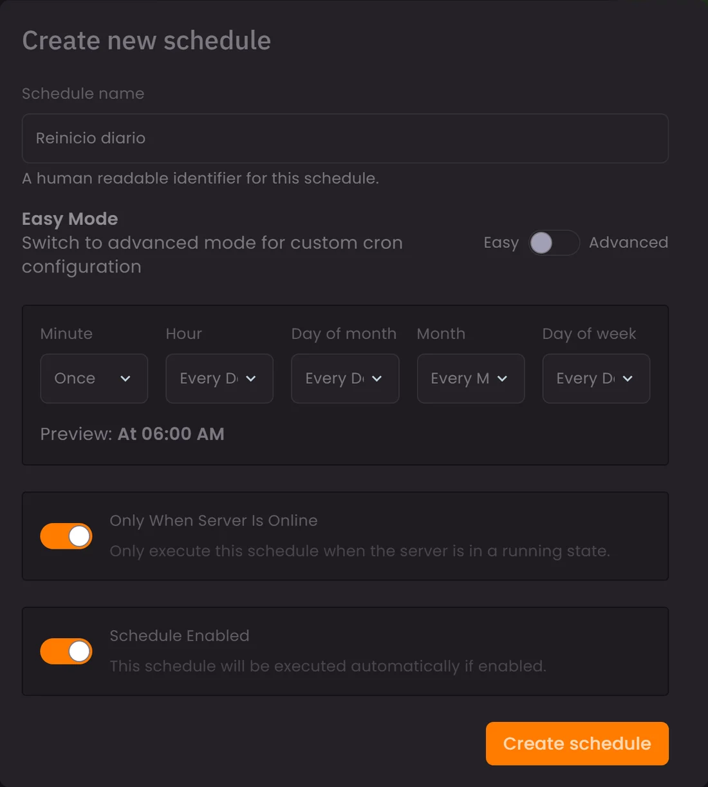
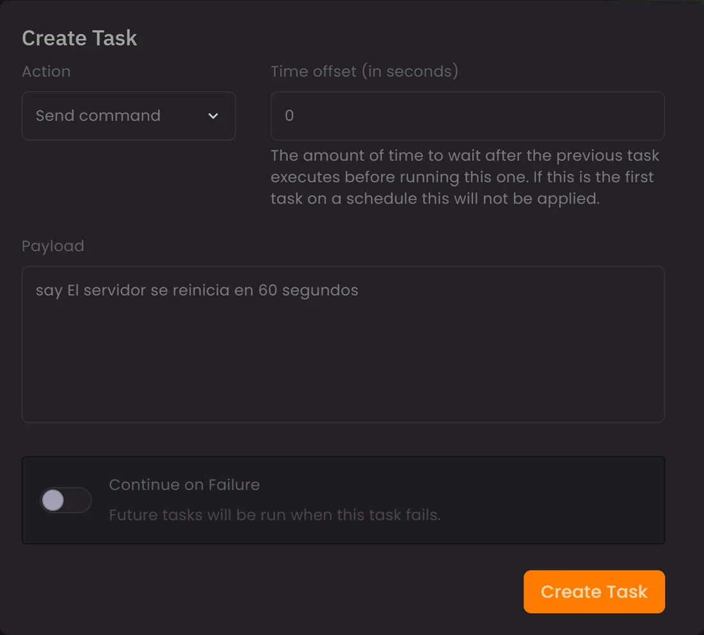

Las tareas programadas están en la pestaña **Schedules** y sirven para que el
servidor haga solo lo que harías tú a mano: reiniciarse de madrugada, guardar
el mundo cada pocas horas o lanzar una copia de seguridad cada noche. **No hace
falta saber cron**: el formulario se abre en modo fácil, con desplegables.

## Crear la tarea

Pulsa **Create schedule**. En el formulario:

- **Schedule name**: un nombre que se entienda, como `Reinicio diario`.
- **Easy / Advanced**: el modo fácil usa desplegables con opciones ya hechas
  (*Cada 5 minutos*, *Cada día a medianoche*, *Días laborables*, *Fin de
  semana*…). El avanzado te da los cinco campos de cron, y con él aparece un
  botón de **chuleta** con ejemplos.
- Debajo de los desplegables hay una **vista previa en texto** del tipo
  «Every 5 minutes», que te confirma lo que acabas de configurar antes de
  guardar. Léela siempre: es la forma más rápida de cazar un error.
- **Only When Server Is Online**: la tarea solo se ejecuta si el servidor está
  encendido.
- **Schedule Enabled**: si lo desmarcas, la tarea se guarda pero no se ejecuta.
  Útil para dejarla preparada y activarla más adelante.

Al guardar, la tarea aparece en la lista con su estado y la hora de la próxima
ejecución.

## Añadir acciones

Una tarea vacía no hace nada: hay que darle acciones. Entra en ella y pulsa
**New Task**:

| Acción | Qué hace |
| --- | --- |
| **Send command** | Envía un comando a la consola, igual que si lo escribieras |
| **Send power action** | Arranca, reinicia, para o mata el proceso del servidor |
| **Create backup** | Lanza una copia de seguridad |

Cada acción tiene además dos ajustes importantes:

- **Time offset (in seconds)**: cuánto espera esta acción después de que
  termine la anterior. En la primera acción de la tarea no se aplica.
- **Continue on Failure**: si esta acción falla, las siguientes se ejecutan
  igualmente.

Ese retraso es la pieza clave: es lo que te permite avisar antes de reiniciar.

## Tres recetas que funcionan

### Reinicio diario avisando a los jugadores

Tarea con periodicidad **cada día a las 6:00** y dos acciones:

1. **Send command** → `say El servidor se reinicia en 60 segundos`
   (retraso: 0)
2. **Send power action** → `restart` (retraso: **60**)

Marca **Only When Server Is Online**: si el servidor ya está parado, no hay
nada que reiniciar.

### Copia de seguridad cada noche

Tarea **cada día a medianoche** con una sola acción, **Create backup**. Si tu
plan tiene un límite de copias, acuérdate de bloquear las que quieras
conservar; si no, la rotación acabará llevándoselas.

### Guardado periódico del mundo

Tarea **cada hora** con una acción **Send command** → `save-all`. Reduce lo que
se pierde si el servidor se cae entre guardados automáticos.

## Errores que se ven en el soporte

- **Poner el reinicio en hora punta.** Míralo con la lista de conexiones
  delante y elige el hueco más muerto del día.
- **Reiniciar sin avisar.** Un `say` sesenta segundos antes evita la mitad de
  las quejas.
- **Encadenar acciones con retraso 0.** Si la copia tarda dos minutos y el
  reinicio entra a los cero segundos, te cargas la copia a medias.
- **Programar cada 5 minutos «por si acaso».** Cada ejecución consume recursos;
  para un `save-all`, cada hora sobra.
- **No volver a mirarlo.** Entra de vez en cuando en la pestaña y comprueba la
  columna de última ejecución: una tarea que lleva semanas sin correr no te
  está protegiendo de nada.

## Combínalas con las copias

Los reinicios automáticos y [las copias de seguridad](/blog/copias-seguridad-backups-panel/)
son las dos automatizaciones que de verdad cambian el día a día de un servidor.
Con las dos puestas, puedes desaparecer una semana y el servidor sigue en pie.
